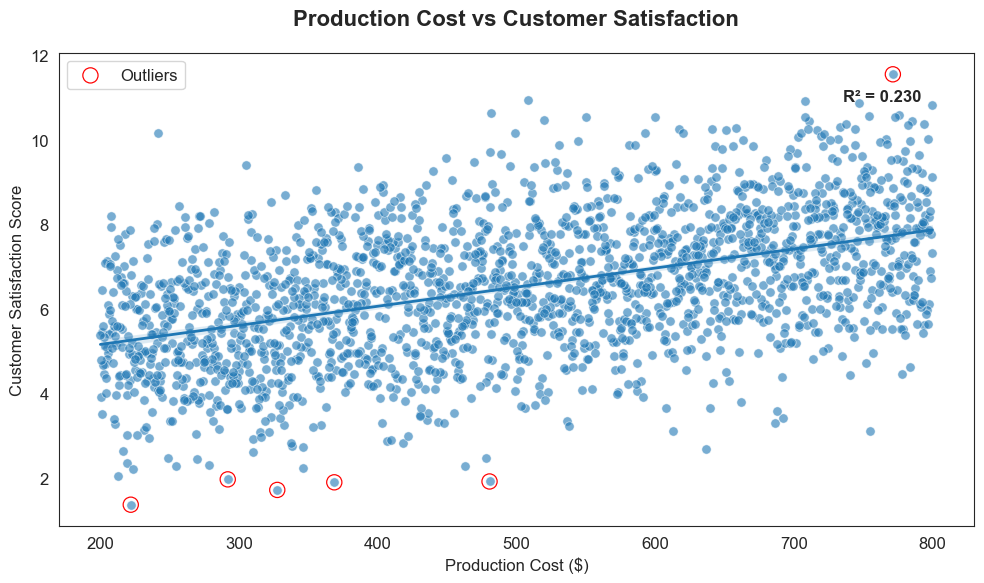
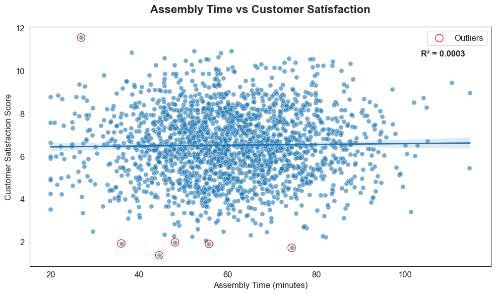

<div align = "justify">

# 🚴 VoltBike Operational Analysis (Python Project) 


---
<div align = "center">




</div>

---

## 🔹 خلاصه فارسی (برای مدیران و کارفرمایان):

این پروژه یک تحلیل عملیاتی مبتنی بر پایتون است که بررسی می‌کند
آیا بهینه‌سازی فرآیند تولید واقعاً باعث افزایش رضایت مشتری و
ایجاد ارزش تجاری می‌شود یا خیر.
نتایج نشان می‌دهد تمرکز صرف بر کاهش زمان مونتاژ و افزایش هزینه تولید،
اثر محدودی بر رضایت مشتری دارد و سرمایه‌گذاری در نوآوری محصول،
نسبت به بهینه‌سازی جزئی فرآیند،
تصمیم منطقی‌تر و پربازده‌تری برای مدیریت و تخصیص منابع است.

---

**“Don’t build it better — build it differently.”** 
This project started with a simple question: If the company spends more on production and improves the process, will customers actually be more satisfied?
The results suggest that innovation may create more long‑term value than small improvements in a process that already works reasonably well.
This project focuses on the overall strategic picture. A deeper optimization for each bike type could be explored in future work.

---

## Business Question
Should VoltBike invest more in improving production efficiency, or focus on product innovation to increase customer satisfaction?

This analysis evaluates whether reducing assembly variability and increasing production spending meaningfully improves customer satisfaction.

---

## 🔎 What We Expected vs What the Data Showed

**Initial assumption**
Spending more on production and improving efficiency should increase customer satisfaction.

**What the data actually showed:**  
- Assembly time varies between units, but it does not strongly affect customer satisfaction.
- Production cost has only a moderate relationship with satisfaction (R² ≈ 0.23). 
- **The larger opportunity seems to be product innovation rather than minor process improvements**.

---

## 🔍 Key Insights (Decision-Oriented)

<div align = "center">

| Insight | Meaning | Business Impact |
|---------|---------|-----------------|
| Average assembly time ≈ 60 min, but only ~16% of units fall within ±5% of that value | The process is not fully stable or repeatable | Some room for improvement, but gains are limited |
| R² = 0.23 (cost vs satisfaction) | Higher production cost explains only about 23% of satisfaction changes | Cost has limited power to drive satisfaction on its own |
| Cost–satisfaction correlation r ≈ 0.48 | Cost and satisfaction move together, but only moderately | Spending more has diminishing returns — it is not a strong lever |
| Customer satisfaction ~6.5 across all bike types | Models are not meaningfully different in how customers feel about them | Focus on product innovation and differentiation, not small refinements |

</div>

---

## Methodology

The analysis was conducted in four steps:

1. Data cleaning and validation
2. Exploratory data analysis (EDA)
3. Variability and correlation analysis
4. Business interpretation of statistical results

---

## 🎯 Final Message

**Don’t build it better — build it differently.**  
Budget for improvement should go toward **innovation**, not endless process optimization.

---

## Limitations

- The dataset is simulated and represents aggregated operational data.
- Customer satisfaction is measured using a single score.
- More granular analysis by bike type could provide deeper insights.

---

## 🚀 Strategic Actions

<div dir="ltr" align = "center">
  <table style="width: 100%; border-collapse: collapse; border: 1px solid #ddd;">
    <thead>
      <tr style="background-color: #f2f2f2;">
        <th style="padding: 12px; border: 1px solid #ddd; width: 46%; text-align: left;">Action</th>
        <th align="center" style="padding: 12px; border: 1px solid #ddd; width: 18%;">Impact</th>
        <th align="center" style="padding: 12px; border: 1px solid #ddd; width: 18%;">Effort</th>
        <th align="center" style="padding: 12px; border: 1px solid #ddd; width: 18%;">Priority</th>
      </tr>
    </thead>
    <tbody>
      <tr>
        <td style="padding: 10px; border: 1px solid #ddd; text-align: left;">Develop new product features (instead of only refining existing models)</td>
        <td align="center" style="padding: 10px; border: 1px solid #ddd;">⭐ High</td>
        <td align="center" style="padding: 10px; border: 1px solid #ddd;">Medium</td>
        <td align="center" style="padding: 10px; border: 1px solid #ddd;">🔥 High</td>
      </tr>
      <tr>
        <td style="padding: 10px; border: 1px solid #ddd; text-align: left;">Collect deeper customer feedback (beyond simple satisfaction scores)</td>
        <td align="center" style="padding: 10px; border: 1px solid #ddd;">Medium</td>
        <td align="center" style="padding: 10px; border: 1px solid #ddd;">Medium</td>
        <td align="center" style="padding: 10px; border: 1px solid #ddd;">High</td>
      </tr>
      <tr>
        <td style="padding: 10px; border: 1px solid #ddd; text-align: left;">Maintain current production standards; only fix clear issues</td>
        <td align="center" style="padding: 10px; border: 1px solid #ddd;">Medium</td>
        <td align="center" style="padding: 10px; border: 1px solid #ddd;">Low</td>
        <td align="center" style="padding: 10px; border: 1px solid #ddd;">Medium</td>
      </tr>
      <tr>
        <td style="padding: 10px; border: 1px solid #ddd; text-align: left;">Avoid large extra investment in process optimization without clear benefit</td>
        <td align="center" style="padding: 10px; border: 1px solid #ddd;">Low</td>
        <td align="center" style="padding: 10px; border: 1px solid #ddd;">Low</td>
        <td align="center" style="padding: 10px; border: 1px solid #ddd;">Low</td>
      </tr>
    </tbody>
  </table>
</div>

---

## 📊 Analytical Highlights

- Cleaned the dataset carefully while keeping the original patterns in the data
- Used IQR and consistency checks to understand how much the results vary
- Studied the relationship between production cost, assembly time, and customer satisfaction using correlation and R²
- Created visualizations focused on supporting business decisions
- Looked at the results from a practical business viewpoint, not only from a statistical side

---

## 🧮 Assembly Performance Snapshot

```text
- Average assembly time ≈ 60 minutes
- Only ~16% of records within ±5% of the mean
- Only ~32% of records within ±10% of the mean
- R² (assembly time → satisfaction) ≈ 0.018
```

📌 Variability exists, **but it doesn’t meaningfully change what customers value.**  
🔒 So **heavy investment to optimize assembly time further is not cost-justified.**

---

## 🛠 Tools & Skills Demonstrated

<div align = "center">

| Area | Implementation |
|------|----------------|
| Python | pandas, numpy, matplotlib, seaborn |
| Statistics | IQR, correlation, regression (R²) |
| Business | Turning analysis into clear decisions |
| Visualization | Variance, boxplots, scatter plots with regression lines |

</div>

---

## 📂 Project Structure

```text
VoltBike_Analysis/
├─ Data/
│  └─ ebike_data.csv
├─ Images/
│  └─ logo.png
├─ Scripts/
│  ├─ cleaning.py
│  ├─ analysis.py
│  └─ visualization.py
├─ Results/
│  └─ final_data.csv
├─ Visuals/
│  ├─ avg_production_cost.png
│  ├─ avg_assembly_time.png
│  ├─ avg_customer_satisfaction.png
│  ├─ assembly_time_variability.png
│  ├─ customer_satisfaction_variability.png
│  ├─ cost_vs_satisfaction.png
│  ├─ assembly_time_vs_satisfaction.png
│  └─ Voltbike_Analysis_Animation.gif
├─ Executive_Summary/
│  ├─ VoltBike_Insight_Summary_FA.pdf
│  └─ VoltBike_Insight_Summary.pdf
├─ README.md
└─ README_FA.md
```

---

## ▶️ How to Run

```bash
python cleaning.py --input Data/ebike_data.csv --output Results/final_data.csv
python analysis.py --input Results/final_data.csv
python visualization.py
```

---

## 📌 Dataset

- **Source:** Simulated industrial production dataset  
- **Records:** 2,000  
- **Columns:** `bike_type`, `production_cost`, `assembly_time`, `customer_score`

---

## 📁 Full Insight Report & Animation

👉 **Executive Summary ([PDF – English](Executive_Summary/VoltBike_Operational_Analysis_Insight_Summary.pdf)):** Structured overview of operational performance, production variability, customer satisfaction insights, and recommended strategic actions.

👉 **Executive Summary ([PDF – Persian](Executive_Summary/VoltBike_Operational_Analysis_Insight_Summary_FA.pdf))** Persian version of the executive summary  

👉 **Walkthrough GIF ([Walkthrough – GIF](Visuals/Voltbike_Analysis_Animation.gif)):** Quick tour of the project folders, code, and charts created

---

## 👤 Author

**Asma Sistani – Data Analyst**  
Helping businesses make better decisions through data, analytics, and clear storytelling. 

💻 **GitHub:** [](https://github.com/asma-sistani)

🔗 **LinkedIn:** [](https://www.linkedin.com/in/asma-sistani)

🌐 **Portfolio:** [](https://asmatheanalyst.github.io/portfolio.html)

---

**This project shows how questioning assumptions leads to smarter investment decisions — and why innovation matters more than minor process refinement.**

---

</div>